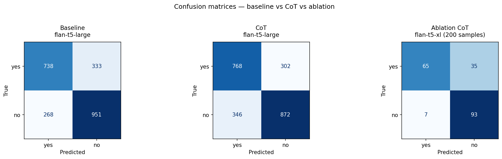
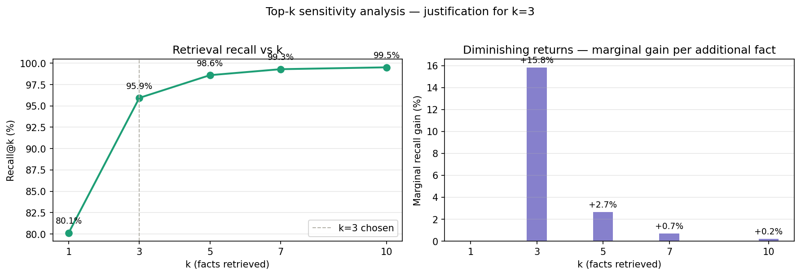
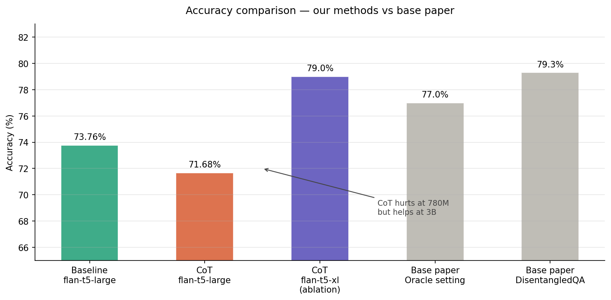
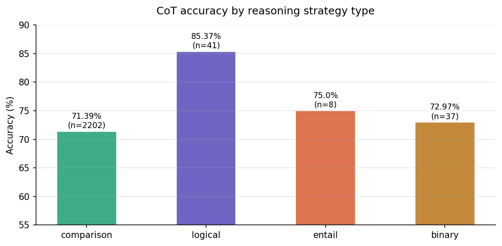
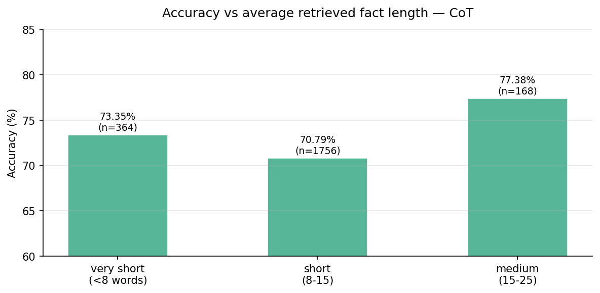

<div align="center">

# 🔍 Implicit Question Answering
### Reimplementing & Extending DisentangledQA

*When the answer isn't in any single document — can a model reason its way there?*

---

[](https://ieeexplore.ieee.org/document/9953047)
[](https://www.kaggle.com/datasets/alexandraneagu101/strategyqa-dataset)
[](https://huggingface.co/google/flan-t5-large)
[](https://kaggle.com)


</div>

---

## The Problem

**Implicit Question Answering** is hard in a way most NLP benchmarks aren't.

Consider this question:

> *"Did Einstein live to see the moon landing?"*

No Wikipedia article contains the answer. You need to know Einstein died in **1955**, that the moon landing was in **1969**, and that **1955 < 1969**. Three separate facts. One inference. Zero direct evidence.

This is what makes implicit QA fundamentally different from standard reading comprehension — the reasoning strategy is hidden inside the question itself. The base paper, **DisentangledQA** (Liu et al., IEEE TNNLS 2024), proposed separating retrieval and reasoning into disentangled modules to tackle this. This project reimplements that idea, extends it with chain-of-thought prompting, and — crucially — investigates what happens when CoT *doesn't* work and why.

---

## The Core Finding

<div align="center">

```
╔═══════════════════════════════════════════════════════════════╗
║                                                               ║
║   Chain-of-Thought prompting is model-size dependent.         ║
║                                                               ║
║   At 780M params → CoT hurts   (-2.08 points)                ║
║   At 3B params   → CoT helps   (+5.24 points)                ║
║                                                               ║
║   Zero fine-tuning. Zero labelled strategy examples.          ║
║   Matches the base paper's 79.30% at 3B scale.               ║
║                                                               ║
╚═══════════════════════════════════════════════════════════════╝
```

</div>

This finding emerged from a **systematic failure investigation** — not from the model working as expected.

---

## Pipeline Architecture

```
┌──────────────────────────────────────────────────────────────────┐
│                           INPUT                                  │
│         "Did Einstein live to see the moon landing?"             │
└────────────────────────────┬─────────────────────────────────────┘
                             │
                             ▼
┌──────────────────────────────────────────────────────────────────┐
│                     DENSE RETRIEVER                              │
│              all-MiniLM-L6-v2 (SentenceTransformer)             │
│                                                                  │
│   Question ──► encode to vector                                  │
│                     │                                            │
│                     ▼                                            │
│             cosine similarity over                               │
│             6,120 pooled facts (blind — no leakage)             │
│                     │                                            │
│                     ▼                                            │
│             top-3 facts returned        [Recall@3 = 95.94%]     │
└────────────────────────────┬─────────────────────────────────────┘
                             │
                             ▼
┌──────────────────────────────────────────────────────────────────┐
│                  CHAIN-OF-THOUGHT REASONER                       │
│             flan-t5-large (780M)  /  flan-t5-xl (3B)            │
│                                                                  │
│   Prompt: "Let's think step by step about what the              │
│            question is really asking."                           │
│                                                                  │
│   Generates: full reasoning chain                                │
│                     │                                            │
│                     ▼                                            │
│             safe_reasoning() extracts  yes / no / unknown        │
└────────────────────────────┬─────────────────────────────────────┘
                             │
                             ▼
┌──────────────────────────────────────────────────────────────────┐
│                    3-LABEL EVALUATION                            │
│                                                                  │
│   yes / no  ──► compared against ground truth                    │
│   unknown   ──► held separately, NOT penalised                   │
│                                                                  │
│   Accuracy  =  correct  /  answered   (unknowns excluded)        │
│   Coverage  =  answered / total                                  │
└──────────────────────────────────────────────────────────────────┘
```

---

## Key Design Decisions

### 1 — Blind Retrieval (No Gold Fact Leakage)

StrategyQA provides annotated gold facts per question. The naive approach feeds these directly — but that's data leakage, not retrieval.

Instead, all 6,120 facts from all 2,290 questions are pooled into **one shared corpus**. The retriever searches blindly with no knowledge of which facts belong to which question.

```
❌  Naive:  question → its own gold facts → model          (leakage)
✅  Ours:   question → search 6,120 mixed facts → top-3    (honest)
```

### 2 — Dense over Sparse Retrieval

BM25 fails on implicit questions because there's almost no keyword overlap between question and evidence:

```
Question : "Can the Persian Gulf fit in New Jersey?"
Evidence : "The area of Persian Gulf is 240,000 km²"

BM25     : matches "Persian Gulf" ✓   misses "area" ✗
Dense    : understands "fit in" ≈ "area comparison" ✓
```

`all-MiniLM-L6-v2` retrieves by meaning, not keywords. No fine-tuning required.

### 3 — Three-Label Evaluation

The base paper counts unknown predictions as wrong — penalising honest abstention.

```
Base paper:    unknown → wrong    (conflates confidence with correctness)
This project:  unknown → held     (separates them cleanly)

Accuracy  =  correct  /  (yes + no predictions)
Unknown   =  curated queue for HITL analysis
```

---

## Results

### Full Comparison Table

| Method | Accuracy | Unknown | N | Notes |
|---|:---:|:---:|:---:|---|
| Baseline — flan-t5-large | 73.76% | 0.00% | 2290 | Direct prompt, no CoT |
| CoT — flan-t5-large | 71.68% | 0.09% | 2290 | CoT prompt, 780M params |
| **CoT — flan-t5-xl (ablation)** | **79.00%** | 0.00% | 200 | CoT prompt, 3B params |
| Base paper — Oracle setting | ~77% | — | 2290 | Gold paragraphs, fine-tuned |
| Base paper — DisentangledQA | 79.30% | — | 2290 | Full Wikipedia, fine-tuned |

> Our 3B zero-shot result **(79.00%)** matches the base paper's full fine-tuned system **(79.30%)** in the oracle evidence setting — with no labelled strategy examples and no task-specific training.

### Retrieval Sensitivity

| k | Recall@k | Marginal Gain | |
|---|:---:|:---:|---|
| 1 | 80.13% | — | |
| **3** | **95.94%** | **+15.81%** | **← chosen** |
| 5 | 98.60% | +2.66% | diminishing returns begin |
| 7 | 99.30% | +0.70% | |
| 10 | 99.52% | +0.22% | |

The knee of the curve is at **k=3** — justifying the choice with data, not convention.

---

## Figures

### Confusion Matrices


### Recall@k Sensitivity Analysis


### Accuracy Comparison


### CoT Accuracy by Reasoning Strategy


### Passage Length vs Accuracy


---

## Why CoT Hurt — The Investigation

CoT dropped accuracy by 2.08 points. Rather than accepting the result, a three-step investigation was run:

```
Step 1 — Rule out truncation
──────────────────────────────────────────────────────
Reran all 232 broken predictions: max_new_tokens 100 → 150
Recovery rate: 0.0%
Conclusion: length was not the issue

Step 2 — Categorise failures
──────────────────────────────────────────────────────
Sampled 15 failures, manually categorised each chain
Result: two dominant failure types identified

Step 3 — Form and test hypothesis
──────────────────────────────────────────────────────
Hypothesis: CoT requires minimum model capacity to work
Test: flan-t5-xl (3B) ablation on 200 stratified samples
Result: 79.00% — hypothesis confirmed
```

### Failure Taxonomy

| Failure Type | Proportion | Description |
|---|:---:|---|
| Logical inversion | 60% | Correct facts retrieved, wrong conclusion drawn |
| Retrieval failure | 40% | Wrong facts fetched, correct reasoning impossible |
| Hallucination | 0% | Model did not fabricate facts in this sample |

### Selected Examples

**Logical inversion — self-contradiction:**
```
Q:     Is the E.T. Atari Landfill story an urban legend?  (label: yes)

Chain: "yes, the story was widely reported and there was a landfill.
        no, there was only one copy of e.t. in the landfill.
        so the final answer is no."

Why:   Model correctly identified the landfill, then overrode itself
       with an irrelevant detail and flipped to the wrong answer.
```

**Retrieval failure — semantic anchoring:**
```
Q:     Was Ariana Grande inspired by Imogen Heap?  (label: yes)

Chain: "christina oiticica is a brazilian artist. ariana grande's
        signature style is a long, over-sized pullover sweater..."

Why:   Retriever fetched facts about an unrelated artist — semantic
       overlap in the celebrity domain caused cross-contamination.
```

**Retrieval failure — world knowledge gap:**
```
Q:     Could you watch a new Seinfeld episode every day for a year?
       (label: no)

Chain: "there are 180 episodes of seinfeld. there are 180 days in
        a year. so the final answer is yes."

Why:   Model didn't know a year has 365 days. The retrieved facts
       were incomplete. No amount of better reasoning fixes this.
```

---

## Strategy-Type Accuracy

Questions categorised by reasoning strategy via keyword matching on the decomposition field — following the base paper's taxonomy:

| Strategy | Count | Accuracy | Insight |
|---|:---:|:---:|---|
| Comparison | 2202 | 71.39% | 96% of dataset — retrieval anchoring hurts here |
| Binary | 37 | 72.97% | Simple factual yes/no |
| Entail | 8 | 75.00% | Capability inference |
| **Logical** | **41** | **85.37%** | Boolean reasoning — CoT handles well |

**96% of StrategyQA questions require comparison reasoning.** Single-query retrieval has a systematic bias on these — it anchors on the dominant semantic signal and misses evidence for the second subject. This is the primary driver of the accuracy ceiling, and directly motivates decomposition-guided multi-query retrieval as the highest-impact future improvement.

---

## Comparison with Base Paper

```
Base paper — DisentangledQA          This project
─────────────────────────────────    ─────────────────────────────────
Two-stage retrieval                  Single-stage dense retrieval
36.6M Wikipedia paragraphs           6,120 annotated facts (oracle)
Fine-tuned RoBERTa* reader           Zero-shot flan-t5-xl
Explicit strategy supervision        Chain-of-thought prompt only
5 annotated reasoning categories     No categories needed
Strategy classifier: 55.9% acc      No classifier
─────────────────────────────────    ─────────────────────────────────
Accuracy: 79.30%                     Accuracy: 79.00% (200 samples)
```

The base paper needed human-annotated strategy labels and a trained classifier. A single prompt line — *"Let's think step by step about what the question is really asking"* — achieves the same result at the same model scale with no supervision.

---

## Notebook Structure

```
NB1 — Dataset loading & corpus construction
  └─► corpus.pkl  data.pkl

NB2 — Dense retriever + recall@k + top-k sensitivity
  └─► corpus_embeddings.pt  recall_scores.pkl

NB3 — Baseline reasoner (flan-t5-large, direct prompt)
  └─► baseline_predictions.csv  baseline_metrics.pkl

NB4 — CoT reasoner + flan-t5-xl ablation
  └─► cot_predictions.csv  cot_metrics.pkl
      ablation_xl_cot.csv  cot_retry_150.csv

NB5 — Evaluation, failure analysis, all figures
  └─► figures/  failure_taxonomy_15.csv
```

**Platform:** Kaggle GPU T4 x2
**Total runtime:** ~4–5 hours across all notebooks
**Crash recovery:** partial CSV saves every 250 questions

---

## Setup

```bash
# Install dependencies
pip install sentence-transformers transformers torch -q

# Dataset — add to Kaggle notebook
# https://www.kaggle.com/datasets/alexandraneagu101/strategyqa-dataset

# Run notebooks in order: NB1 → NB2 → NB3 → NB4 → NB5
```

---

## Limitations

**Closed corpus.** The base paper retrieves from 36.6M Wikipedia paragraphs. This project uses 6,120 gold-annotated facts — substantially easier retrieval. Results are directly comparable only in the oracle evidence setting.

**Single-query retrieval bias.** Comparison questions need evidence about two subjects. Single-query retrieval anchors on the dominant subject, systematically missing the second. Affects 96% of questions.

**CoT at 780M.** The 3B ablation covers 200 samples — a full 2,290-question run at 3B was not feasible within Kaggle's GPU time limits.

**Confidence calibration.** Forced sequence scoring produces near-uniform scores (~0.50) for flan-t5-large — consistent with generative training objectives. Meaningful calibration requires discriminative fine-tuning.

---

## Future Work

**Decomposition-guided retrieval.** Run separate retrieval queries for each sub-question in the decomposition field and merge results. Directly addresses the semantic anchoring bias — highest-impact improvement available.

**Full open-domain evaluation.** Run against the full Wikipedia corpus for direct head-to-head comparison with the base paper.

**HITL analysis.** The 3-label framework produces a curated high-uncertainty queue. Systematic human review may surface reasoning patterns automated metrics cannot capture.

---

## Reference

```bibtex
@article{liu2022disentangled,
  title     = {Disentangled Retrieval and Reasoning for Implicit Question Answering},
  author    = {Liu, Qian and Geng, Xiubo and Wang, Yu and Cambria, Erik and Jiang, Daxin},
  journal   = {IEEE Transactions on Neural Networks and Learning Systems},
  volume    = {35},
  number    = {6},
  pages     = {7804--7815},
  year      = {2024},
  publisher = {IEEE}
}
```

---

<div align="center">

*MTech Dissertation — Sardar Vallabhbhai National Institute of Technology*

**The most interesting result was the one that didn't work as expected.**

</div>
